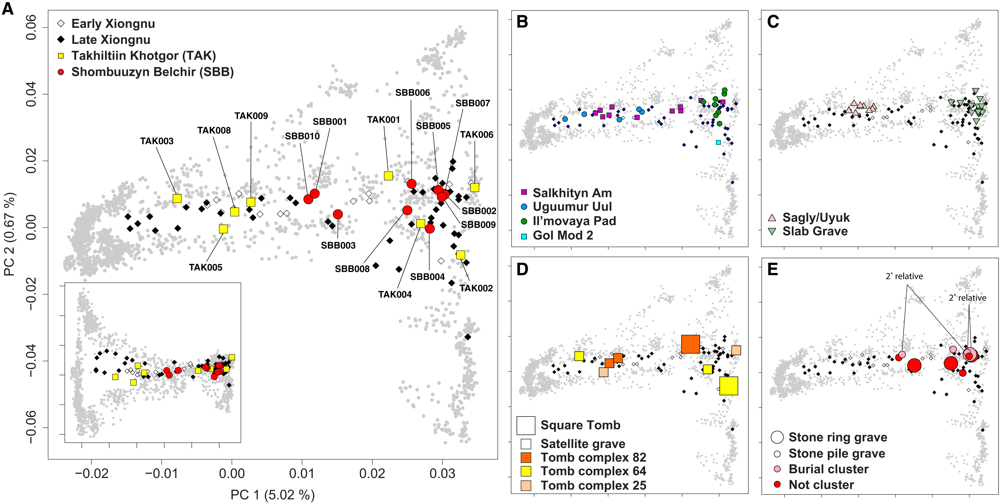
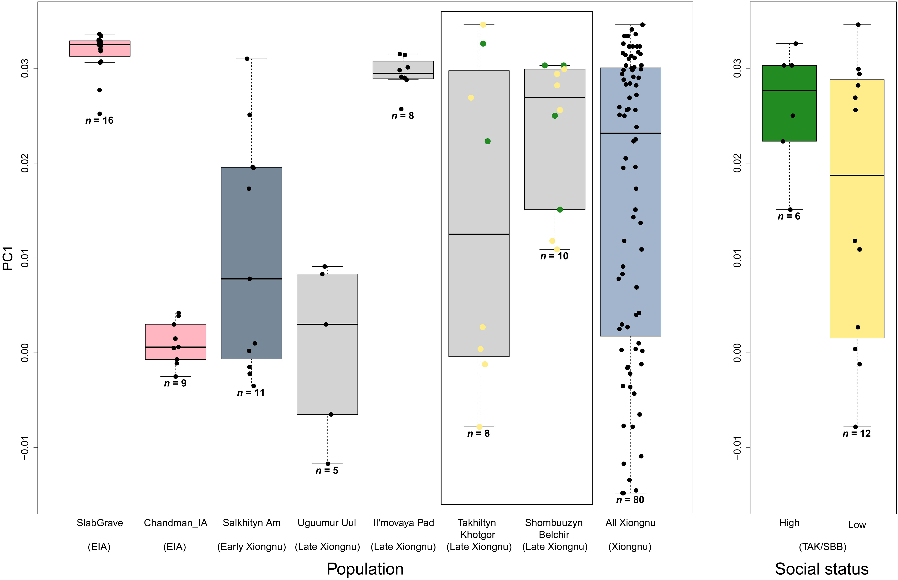

## Data Analysis Replication: PCA and Welch’s t-test"

```{r}
getwd()
knitr::opts_chunk$set(fig.path = "images/")
library(tidyverse)
library(readr)
library(stringr)
library(dplyr)
library(car)
library(ggplot2)
```

## Introduction

This report replicates parts of the statistical analyses from the study

-   Juhyeon Lee *et al.* Genetic population structure of the Xiongnu Empire at imperial and local scales.*Sci. Adv.***9**,eadf3904(2023).DOI:[10.1126/sciadv.adf3904](https://doi.org/10.1126/sciadv.adf3904)

The goal of this paper was to understand how genetic diversity was organized within the Xiongnu Empire (nomadic empire in late Iron age and historical era), especially at the local level and across different social statuses. The authors studied genome-wide data from 18 individuals buried in aristocratic and elite cemeteries at the western edge of the empire. Their analyses included PCA, genetic relatedness, admixture modeling and statistical tests to compare ancestry differences between individuals. They found that even within small communities, the genetic diversity was very high, just like across the whole empire. Low-status individuals were the most diverse, while high-status people were more similar to each other.

I replicated the following:

-   Principal Component Analysis (PCA) with ancient and modern samples
-   PCA Visualization matching paper's Figure 3A
-   Inferential statistical analyses using Welch’s t-test and Brown-Forsythe test

I chose this paper because it aligns closely with my own research interests — it works with ancient DNA and focuses on Eurasian populations, the Xiongnu. What I really liked is that the study didn’t stop at PCA. They went further and applied statistical tests after PCA, comparing groups by sociopolitical status and by burial site. This gave me a new approach that I can actually test hypotheses statistically after the PCA using the result of it for checking whether elites have different ancestry patterns or whether variation differs by site. It’s a good direction that I think I can apply to my own data.

Overall: The original study used the Human Origins dataset (v54.1.p1_HO_public) merged with new TAK_SBB.1240K samples. The merged data included 500,000 SNPs and over 20,000 individuals in EIGENSTRAT format. I subsetted and visualized PCA projections and statistically tested genetic diversity between social status groups and archaeological sites.

## Data Discovery Process and Challenges

The paper cited older publications for the Human Origins (HO) dataset but did not directly provide download links. I traced the original reference to the 2014 paper, *"Ancient human genomes suggest three ancestral populations for present-day Europeans"* , where Supplementary Information 9 (SI9) on page 60 states:

> “A total of 2,244 samples (of the 2,722) are in a version of the dataset we have made freely available at <http://genetics.med.harvard.edu/reichlab/Reich_Lab/Datasets.html.”>

However, the URL is outdated and no longer functional. I wish the authors had included a direct and updated link to the data. To resolve this, I contacted Dr. Ainash Childebayeva, who provided the current official data source:

<https://reich.hms.harvard.edu/allen-ancient-dna-resource-aadr-downloadable-genotypes-present-day-and-ancient-dna-data>

From this website, I downloaded the **v54.1.p1_HO_public** dataset, which contains:

-   20,503 individuals (.ind file)
-   597,573 SNPs (.snp file)
-   Genotypes in EIGENSTRAT format (.geno file)

The paper provided their new samples in eigenstrat format data:

“The genotype data for the 1240K panel have been deposited in the Edmond Data Repository of the Max Planck Society \[<https://doi.org/10.17617/3.DYCH7D>\].” (from paper)

I downloaded the data into TAK_SBB.1240K folder.

## Preparing Input Data

### Read .ind file from HO dataset

```{r read-ind}
ind <- read_table("data/v54.1.p1_HO_public/v54.1.p1_HO_public.ind", col_names = FALSE)
colnames(ind) <- c("ID", "Sex", "Pop")
dim(ind)
```

### Filter populations for PCA

I used the paper's Supplementary Table S1B to extract the populations used for PCA (`PCA_used.csv`) - contains list of the population used for PCA and their dataset.

From there I extracted the list of the populations, mostly modern populations and only few ancient populations – like Xiongnu period samples – as its related to the study research samples; and I kept less due to computation capacity – worried to crash my computer (however, anyway crashed)

```{r}
pop_table <- read_csv("data/PCA_used.csv")
pca_pops <- pop_table |>
  filter(PCA == "O", `HO dataset` == "O") |>
  pull(Analysis.Group.Label)
length(pca_pops)
#from the table where they provided the information which populatioin used for PCA and from which dataset, I extracted where PCA column is O and HO is O;
head(pca_pops)


```

159 population in total used for PCA analyses;

### Check matching populations

```{r}
matching_inds <- ind %>%
  filter(sapply(Pop, function(popname) any(str_detect(popname, pca_pops))))
# from big dataset, matching how many individuals used for PCA analyses  
dim(matching_inds)

```

5499 indiviuals is so many for analysese so I wanted to cut for the 5 individual per population group Sampling 5 individuals per group for PCA

```{r}
subset_inds_1 <- matching_inds |>
  group_by(Pop) |>
  slice_head(n = 5) |>
  ungroup()
dim(subset_inds_1)
head(subset_inds_1)
grep("outlier", subset_inds_1$Pop, value = TRUE)
```

Now the individual numbers are fell down to 2638 individuals. \[still a lot\]

When, I did head(subset_inds_1), noticed that there are outliers, that matched the population name. So I have to exclude them, since they are not in the PCA analyses either;

My \$pca_pop list has names like "French", "Abazin", "Kazakh"

While ind\$Pop column has entries like "French.HO", "Abazin.HO", "Kazakh.HO". (so I used str_detect my popname, but its matching to everything_additionals, like ignore/outlier cases)

So doing different way filtering the data - before matching, removing .HO/DG extension then filtering

```{r}
matching_inds <- ind %>%
  filter(str_remove(Pop, "\\.(HO|DG)$") %in% pca_pops)
head(matching_inds)
subset_inds_2 <- matching_inds |>
  group_by(Pop) |>
  slice_head(n = 5) |>
  ungroup()
dim(subset_inds_2)
head(subset_inds_2)
#now much less individuals
```

```{r}
#this one to check which populations did not match with big dataset of individuals
all_pops <- unique(subset_inds_2$Pop)
matched <- sapply(pca_pops, function(p) any(str_detect(all_pops, p)))
length(pca_pops[!matched])
#I wanted to check which populatiion groups are not in the dataset
pca_pops[!matched]
```

As noticed, most of the ancient population groups do not match - the Suplementary table pop names have different population names with the v54.1 dataset.

It's so confusing there is no consistency between population names and their labelling. Some of them had ending with .HO, while some .DG. while the suplementary table just population names - it was hard to filter and extract desired populations.

The paper grouped some individuals into population groups like "earlyXiongnu" and "lateXiongnu". In the supplementary file S1B they provided which group has which individuals, so I extracted those groupings manually.

```{r}
#Here when looked into dataset those populatioin names do not exist, but individuals that belong that population exist, so they just have different names
grep("earlyXiongnu", ind$Pop, value = TRUE)
grep("lateXiongnu", ind$Pop, value = TRUE)
ind[grep("JAG001", ind$ID), ]
```

```{r}

```

In PCA plot from the paper, there is Early and LATE xiongnu groups ONLY, while in the SI table:

```         
"earlyXiongnu_rest"     "earlyXiongnu_west" "lateXiongnu"           "lateXiongnu_han"       "lateXiongnu_sarmatian" 
```

So I am going to rename populations that have those individuals to Early and Late_Xiongnu, respectively Defining Xiongnu groups

```{r}
xiongnu_groups <- list(
  earlyXiongnu = c("JAG001", "SKT002", "SKT004", "SKT005", "SKT006", "SKT012",
                   "AST001", "SKT001", "SKT003", "SKT008", "SKT009", "SKT010"),
  lateXiongnu = c("SAN001", "UGU004", "SOL001", "DEL001", "ULN004", "BTO001",
                  "CHN010", "DOL001", "EME002", "JAA001", "KHO007", "TEV002", "TUK003",
                  "UGU011", "UVG001", "TEV003", "IMA001", "IMA002", "IMA003", "IMA004",
                  "IMA005", "IMA006", "IMA007", "IMA008", "ATS001", "BAM001", "BRU001",
                  "KHO006", "SON001", "TUH001", "TUH002", "TUK002","TMI001", "BUR001",
                  "NAI001", "BUR002", "BRL002","BUR003","BUR004", "DUU001", "HUD001",
                  "NAI002","UGU005", "UGU006", "UGU010")
)
#created the list of the populations and turning into dataframe with each ID there is assigned Population name
xiongnu_df <- bind_rows(lapply(names(xiongnu_groups), function(group) {
  tibble(ID = xiongnu_groups[[group]], Group = group)
}))
head(xiongnu_df)
#xiongnu_df is the list of individuals I want to extract for big dataset .ind
xiongnu_inds <- ind |>
  inner_join(xiongnu_df, by = "ID") |>
  select(ID, Sex, Pop = Group)
#xiongnu_inds is the ones extracted from the bigdataset, in totall 57 inds belong to the Xiongnu
head(xiongnu_inds)
dim(xiongnu_inds)
```

### Saving the subset list of individuals into separate file

```{r}
 
subset_inds <- bind_rows(subset_inds_2,xiongnu_inds) 

write.table(subset_inds, "data/HO_pca_subset_list.ind", 
            row.names = FALSE, col.names = FALSE, quote = FALSE, sep = "\t")
```

I wanted to read original big dataset .geno line-by-line and extract only the selected columns associated with individuals.

```{r}
#infile <- file("data/v54.1.p1_HO_public/v54.1.p1_HO_public.geno", "r")
# .geno file consist of large dataset with 500K rows for 20000 individuals, there I had to extract the information of individuals I made list above; at first I have to extract the indexes of their order from .ind file, and then .geno get that column information.
#outfile <- file("HO_pca_subset.geno", "w")
#keep_inds <- which(ind$ID %in% subset_inds_2$ID)
#while(length(line <- readLines(infile, n = 1)) > 0) {
#  genos <- strsplit(line, "")[[1]]
#  filtered_genos <- genos[keep_inds]
#  writeLines(paste0(filtered_genos, collapse = ""), outfile)
#  }

#close(infile)
#close(outfile)
```

However, it didn’t work, I could not load .geno at all to my computer, at first I thought .geno is only 3 GB – as was shown at website, but it came out it was binary file – I have to convert it – kind of unzip – using plink program (explain plink) – which wasn’t mentioned in any methods – here I stuck also so much!

Then I had to use server, there I found that it’s non-binary file size is 28GB, so its impossible to run it in my computer or in R – due to my RAM is only 16GB.

-\> I wish they could provide the option to chose populations data set, that we want to extract/download from the website - otherwise all of them are so big to do download and data manipulations;

The New samples data, which was provided by paper with 17 individuals:

```{r}
tak_ind <- read_table("data/TAK_SBB.1240K/TAK_SBB.1240K.ind", col_names = FALSE)
colnames(tak_ind) <- c("ID", "Sex", "Pop")
dim(tak_ind)
head(tak_ind)

tak_snp <- read_table("data/TAK_SBB.1240K/TAK_SBB.1240K.snp", col_names = FALSE)
ho_snp <- read_table("data/v54.1.p1_HO_public/v54.1.p1_HO_public.snp", col_names = FALSE)

colnames(ho_snp) <- colnames(tak_snp) <- c("rsid", "chrom", "gen_pos", "phys_pos", "ref", "alt")
dim(ho_snp)
dim(tak_snp)

```

Therefore, I decided to do manipulations in server – big computer cluster – I merged the datasets of big HO and TAK from this paper into one dataset – big data was 500K HO data - while paper 1240K sites data. When we merge it will be 500K snp site information for all population and individuals including new study samples.

## Merging and SmartPCA

I used mergeit from EIGENSOFT on the server to merge the HO and TAK_SBB datasets - same as in paper Methods:

------------------------------------------------------------------------

## mergeit -p merge_param.txt

My parameter merge_param.txt file content:

------------------------------------------------------------------------

geno1: /mnt/archgen/public_data/AADR_V54.1_NOV2022_HO/v54.1_HO_public.geno snp1: /mnt/archgen/public_data/AADR_V54.1_NOV2022_HO/v54.1_HO_public.snp ind1: /mnt/archgen/public_data/AADR_V54.1_NOV2022_HO/v54.1_HO_public.ind geno2: /mnt/archgen/users/seidualy/replication/TAK_SBB.1240K.geno snp2: /mnt/archgen/users/seidualy/replication/TAK_SBB.1240K.snp ind2: /mnt/archgen/users/seidualy/replication/TAK_SBB.1240K.ind genooutfilename: v54_TAK_SBB_HO.geno snpoutfilename: v54_TAK_SBB_HO.snp indoutfilename: v54_TAK_SBB_HO.ind outputformat: EIGENSTRAT docheck: YES strandcheck: YES ---

Then run on server, the mergeit funciton generated to me a big merged file.

Then I used smartpca with to replicate the PCA, as mentioned in the paper methods on population list I have generated:

```{r}
combined <- bind_rows(subset_inds, tak_ind)
colnames(combined)
#combinig the new studya samles (TAK..) to our desired PCA pop list

# ExtractING the 3rd column (population names) AND geting unique sorted list saving into variable pops
pops <- combined |>
  pull(Pop) |>
  sort() |>
  unique()

# Saving only population list to run smartpca
write_lines(pops, "PCA_pop.list")
```

------------------------------------------------------------------------

## smartpca -p pca.par

my pca.par parameter file content:

\_\_\_\_\_\_\_\_\_\_\_\_

genotypename: /mnt/archgen/users/seidualy/replication/v54_TAK_SBB_HO.geno snpname: /mnt/archgen/users/seidualy/replication/v54_TAK_SBB_HO.snp indivname: /mnt/archgen/users/seidualy/replication/v54_TAK_SBB_HO.ind evecoutname: /mnt/archgen/users/seidualy/replication/v54_TAK_SBB_HO_PCA.evec evaloutname: /mnt/archgen/users/seidualy/replication/v54_TAK_SBB_HO_PCA.eval poplistname: /mnt/archgen/users/seidualy/replication/PCA_pop.list lsqproject: YES

\_\_\_\_\_\_\_\_\_\_\_\_\_\_

Again I made an parameter file and run the pca using methods of EIGENSOFT from this website:

<https://github.com/roberta-davidson/ADMIXTURE-smartPCA-PLINK-and-EIGENSOFT/blob/main/README.md>

This produced `.evec` and `.eval` files with eigenvectors and values.

Here, I wanted to show the percentage of total variance explained by each principal component.

```{r}
eigen_df <- read_table("data/v54_TAK_SBB_HO_PCA.eval", col_names = "Eigenvalue") |> slice(1:10)
head(eigen_df)
variance_explained <- eigen_df$Eigenvalue/sum(eigen_df$Eigenvalue) * 100

round(variance_explained, 2)

```

## PCA Visualization

For visualization I wanted to plot PCA plot, as shown in the paper image

```{r}

```

Fig.3A. (A) Principal components analysis (PCA) of Takhiltyn Khotgor (TAK) (yellow squares) and Shombuuzyn Belchir (SBB) (red circles) individuals. Other Xiongnu individuals are shown as hollow diamonds (early Xiongnu) and black diamonds (late Xiongnu). Ancient individuals were projected on the PCs calculated with 2077 present-day Eurasian individuals (gray). Inset shows PC1 on the x-axis and PC3 on the y axis. PC3 explains the 0.33% of the total variance. The x axis and y axis ticks have the same values across all panels, except the inset of (A) where the y axis ranges from −0.04 to 0.06.

### Load and plot PCA output

I am trying to generate the same PCA plot using my eigenvector data.

The PCA_pop.list data we have generated -\> I am making a table of information that ggplot use to color individuals of the population.

\_\_\_\_\_\_\_\_\_\_\_\_\_\_\_\_\_\_\_\_\_

The function of generating table was created to assign to every population a color and shape. I made just general table, so that it was convenient to change according to your desire.

It assign all .HO/DG ending populations as modern group - and to all of them grey circle with 0.8 transparency and size 1, while for others for now red square with size 2 - but by opening file I can adjust to certain pops different size and color;

```{r}
generate_marker <- function(pops) {
  unique_pops <- sort(unique(pops))

  style_table <- tibble(
    Pop = unique_pops,
    Group = if_else(str_detect(unique_pops, "\\.(HO|DG)$"), "modern", unique_pops),
    Shape = if_else(str_detect(unique_pops, "\\.(HO|DG)$"), 16, 15),         # circle for modern, square for others
    Fill = if_else(str_detect(unique_pops, "\\.(HO|DG)$"), "gray", "red"),    # gray for modern, red for others
    Color = if_else(str_detect(unique_pops, "\\.(HO|DG)$"), "gray", "black"), # border color
    Size = if_else(str_detect(unique_pops, "\\.(HO|DG)$"), 1, 2),          # default size for modern vs others
    Transparency = if_else(str_detect(unique_pops, "\\.(HO|DG)$"), 0.8, 1.0)    # transparency
  )

  return(style_table)
}
```

Reading The PCA evec data:

```{r}
evecDat <- read.table("data/v54_TAK_SBB_HO_PCA.evec", col.names=c("Sample","PC1","PC2","PC3","PC4","PC5","PC6","PC7","PC8","PC9","PC10","Pop"))

#pops -is previously assigned unique pops inlcuding PCA population including new samples
marker_df <- generate_marker(pops)

# SavING to CSV
write_csv(marker_df, "data/PCA_marker_style.csv")

##this one is the backbone only, then I manually added different shaped for my interested populations and assigned 
```

I manually assigned different shapes for my groups to match similar plot from figure 1.A.

For individuals – SBB\* - pop-names – red circle with black borders

For individuals – TAK\* - pop-names – yellow rectangular with black border

Then early Xiongnu white kite. Then Late Xiongnu black kite,

### Plot PCA (PC1 vs PC2)

```{r}
###### Install the necessary packages

#install.packages("plotly")
#install.packages("ggplot2")
#install.packages("ggpubr")
###### load the necessary packages

#library(data.table)
#library(tidyverse)
library(plotly)
library(ggplot2)
library(ggpubr)
keep <- read.csv("data/PCA_pop_marker_plot.csv")
evecDat_plotting <- merge(evecDat, keep, by = "Pop")

evecDat_plotting <- evecDat_plotting |> arrange(Transparency) 
### to arrange visibility, less transparent on behind
samples <- as.character(evecDat_plotting$Group)
shapes <- evecDat_plotting$Shape
colors <- as.character(evecDat_plotting$Color)
sizes <- evecDat_plotting$Size
transparency <- evecDat_plotting$Transparency
fill <- as.character(evecDat_plotting$Fill)
Sample_ID <- as.character(evecDat_plotting$Sample)

# Label only select individuals
label_points <- evecDat_plotting %>%
  filter(str_starts(Sample, "TAK") | str_starts(Sample, "SBB")) %>%
  mutate(label_x = PC1 + 0.009,
         label_y = PC2 - 0.03)
label_points <- label_points %>%
  mutate(CleanLabel = str_remove(Sample, "\\..*"))  # Remove .A0101 or similar
# Plot

ggplot(evecDat_plotting, aes(PC1, PC2)) + 
  geom_point(aes(shape=samples, color=samples, fill = samples, size = samples), alpha = transparency)+ 
  labs(title = "PCA\n",x="PC 1",y="PC 2") + 
  geom_segment(data = label_points,
               aes(x = PC1, y = PC2, xend = label_x, yend = label_y),
               color = "black", linewidth = 0.2) +
  # Place the labels
  geom_text(data = label_points,
            aes(x = label_x, y = label_y, label = CleanLabel),
            size = 2.0, hjust = 1, vjust = 1, color = "black") +
  scale_shape_manual(name = "Samples", breaks=samples, labels = samples,values= shapes)+ 
  scale_fill_manual(name = "Samples", breaks=samples, labels = samples,values= fill) + 
  scale_color_manual(name = "Samples", breaks=samples, labels = samples,values= colors) + 
  scale_size_manual(name = "Samples", breaks=samples, labels = samples,values= sizes) + theme_minimal() + 
  theme(legend.text=element_text(size=7), legend.position = c(0.01, 0.99),legend.justification = c("left", "top"),legend.key.size = unit(0.2, "cm"))

ggsave("images/pca_replication1.png", width = 8, height = 6, dpi = 300)

```

PLOT PC1 and PC3. (in small box in fig3.A there is plot of PC1 to PC3)

```{r}
ggplot(evecDat_plotting, aes(PC1, -PC3)) + 
  geom_point(aes(shape=samples, color=samples, fill = samples, size = samples), alpha = transparency)+ 
  labs(title = "PCA\n",x="PC 1",y="PC 3") + 
  scale_shape_manual(name = "Samples", breaks=samples, labels = samples,values= shapes)+ 
  scale_fill_manual(name = "Samples", breaks=samples, labels = samples,values= fill) + 
  scale_color_manual(name = "Samples", breaks=samples, labels = samples,values= colors) + 
  scale_size_manual(name = "Samples", breaks=samples, labels = samples,values= sizes) + theme_minimal() + 
  theme_classic()+
  theme(legend.text=element_text(size=6),legend.position="right")

ggsave("images/pca_replication2.png", width = 8, height = 6, dpi = 300)
```

## Statistical Analysis

### Group by social status

From paper:

*Together, we observe a high degree of genetic heterogeneity and diversity at the elite sites of TAK and SBB, with the highest genetic heterogeneity observed among the lowest-status individuals. In contrast, we find that the highest-status individuals in this study, the aristocratic and local elite females, tended to be less diverse (P = 0.011 for Brown-Forsythe test to compare the PC1 variances of low-status and high-status individuals) with higher levels of eastern Eurasian ancestry. Eastern Eurasian ancestry is represented by the higher PC1 values and the mean of PC1 of the high-status individuals is significantly greater than that of the low-status individuals (P = 0.032 for one-sided Welch’s t test to test the null hypothesis that PC1 mean of high-status individuals is equal to that of low-status individuals). This suggests that elite status and power was disproportionately concentrated among individuals who traced their ancestry back to the preceding EIA Slab Grave groups.*

*On the basis of the broad distribution of SBB and TAK individuals along the PC1 axis, we find that each site is highly heterogeneous. To statistically compare the genetic diversity of each site and the Xiongnu as a whole (“all Xiongnu”), we applied the Brown-Forsythe test for the null hypothesis that two groups have equal PC1 variances (data file S1D). TAK is highly heterogeneous to the level indistinguishable from the variance across all Xiongnu individuals (P = 0.622), while SBB shows less diversity than all Xiongnu (P = 0.030).*

Here, Authors use PC1 as a proxy for genetic ancestry (Eastern versus Western). To investigate whether there were differences in genetic ancestry between social status groups, they conducted two statistical tests on PC1 values.

There was not any table that providing which samples are high status which is low, except with word mentioning in the beginning part of the Results in the paper. But then I confirmed from the author that, whether what I picked from reading are all high status individuals.

The ones that belong to high status are (from Juhyen Lee):

SBB002

SBB003

SBB007

SBB008

TAK001

TAK002

I assigned these individuals to the “high” group, while all other SBB and TAK individuals I categorized as “low” status. At first, the ID of those samples had name.A10101 some extra extensions on the name, so I wanted to get rid of that then assign tags. \[high or low\]

```{r}
pca_df <- evecDat |> mutate(SampleID = str_remove(Sample, "\\..*"))
#removing extra writings after the dot .*
high_status_ids <- c("SBB002", "SBB003", "SBB007", "SBB008", "TAK001", "TAK002")

pca_df <- pca_df |> mutate(Status = case_when(
  SampleID %in% high_status_ids ~ "high",
  str_starts(SampleID, "SBB") | str_starts(SampleID, "TAK") ~ "low",
  TRUE ~ NA_character_
))
#SBB or TAK those not in high status group labelled as low, and the rest population NA

status_test_df <- pca_df |> filter(!is.na(Status))
```

### Welch’s t-test

```{r}
t_test_result <- t.test(PC1 ~ Status, data = status_test_df, alternative = "greater")
print(t_test_result)
#alternative = "greater" because the hypothesis was directional, not two-sided
#high-status individuals were expected to show higher PC1 values
```

The test statistic was t = 1.98 with 15.963 degrees of freedom and a one-sided p-value of 0.03242. The 95% confidence interval for the difference in means was \[0.00099, ∞), supporting the alternative hypothesis that high-status individuals have greater PC1 values than those of low status.

The high-status group showed a higher mean PC1 (0.0186) compared to the low-status group (0.0103), suggesting an enrichment of Eastern Eurasian genetic ancestry among elite individuals in this dataset.

*The same as in paper: (P = 0.032 for one-sided Welch’s t test to test the null hypothesis that PC1 mean of high-status individuals is equal to that of low-status individuals).*

### Brown-Forsythe test

```{r}
library(car)
status_test_df$Status <- as.factor(status_test_df$Status)
levene_result <- leveneTest(PC1 ~ Status, data = status_test_df, center = median)
print(levene_result)
```

To assess whether the high- and low-status groups differed in the variance of their PC1 values the Brown–Forsythe test was performed, which is a version of Levene’s test that uses the median as the center of each group.

The test result showed p-value = 0.01076.

There is statistically significant difference in variance between the two groups.

Thespread or variability of PC1 values is also different between high and low-status individuals. Like, one group may have more heterogeneity in ancestry composition than the other.

*Paper result: (P = 0.011 for Brown-Forsythe test to compare the PC1 variances of low-status and high-status individuals)*

### Boxplot of PC1

```{r}
ggplot(status_test_df, aes(x = Status, y = PC1, fill = Status)) +
  geom_boxplot(width = 0.3, outlier.shape = NA) +
  geom_jitter(width = 0.1, alpha = 0.7) +
  scale_fill_manual(values = c("low" = "yellow", "high" = "green")) +
  theme_minimal() +
  labs(title = "PC1 by Social Status", y = "PC1 (Eastern Ancestry)")
```

Plot from the paper Figure 4, last boxplot showing status by PC1.

```{r}


```

I replicated their extra comparison analyses regarding to the site:

*From paper: On the basis of the broad distribution of SBB and TAK individuals along the PC1 axis, we find that each site is highly heterogeneous. To statistically compare the genetic diversity of each site and the Xiongnu as a whole (“all Xiongnu”), we applied the Brown-Forsythe test for the null hypothesis that two groups have equal PC1 variances (data file S1D). TAK is highly heterogeneous to the level indistinguishable from the variance across all Xiongnu individuals (P = 0.622), while SBB shows less diversity than all Xiongnu (P = 0.030).*

```{r}
#for comparing with all Xiongnu

pca_df <- pca_df |>
  mutate(Site = case_when(
           str_starts(SampleID, "TAK") ~ "TAK",
           str_starts(SampleID, "SBB") ~ "SBB",
           Pop %in% c("earlyXiongnu", "lateXiongnu", "lateXiongnu_han", "lateXiongnu_sarmatian") ~ "Xiongnu",
           TRUE ~ NA_character_
         ))
xiongnu_all <- pca_df |>
  filter(Site == "Xiongnu")

tak_df <- pca_df |>
  filter(Site == "TAK")

tak_vs_xiongnu <- bind_rows(
  xiongnu_all |> mutate(SiteGroup = "Xiongnu"),
  tak_df |> mutate(SiteGroup = "TAK")
)
tak_vs_xiongnu$SiteGroup <- as.factor(tak_vs_xiongnu$SiteGroup)
leveneTest(PC1 ~ SiteGroup, data = tak_vs_xiongnu, center = median)

sbb_df <- pca_df |>
  filter(Site == "SBB")

sbb_vs_xiongnu <- bind_rows(
  xiongnu_all |> mutate(SiteGroup = "Xiongnu"),
  sbb_df |> mutate(SiteGroup = "SBB")
)
sbb_vs_xiongnu$SiteGroup <- as.factor(sbb_vs_xiongnu$SiteGroup)
leveneTest(PC1 ~ SiteGroup, data = sbb_vs_xiongnu, center = median)
```

Individuals from the TAK site (p.value = 0.6102) and those from Xiongnu-associated groups show similar levels of variation in PC1.

While SBB shows less diversity.

Despite my efforts, handling full-genome data locally was infeasible. The `.geno` file was huge and required server-based tools. At first, I tried to make small subset of individuals to run pca on R, but it was impossible to load the initial data. I wanted to run prcomp on small data but 500k SNP data was too much for my limited memory and computing power. So, after I decided to follow as author's method on Eigensoft using smartpca.

The trends observed in PCA and the significance of t-tests aligned well with those in the paper. I confirmed higher PC1 values in elite individuals and significant variance differences using R.

\**GitHub does not allow uploading files larger than 100MB. For this reason, I could not include the .geno files for the TAK_SBB and v54.1.p1_HO_public datasets in this repository.*
